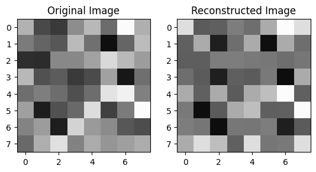
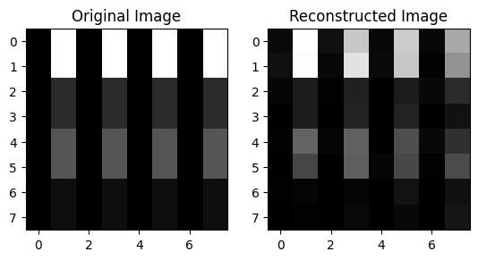
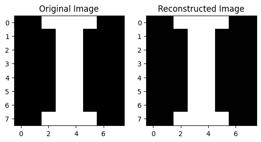
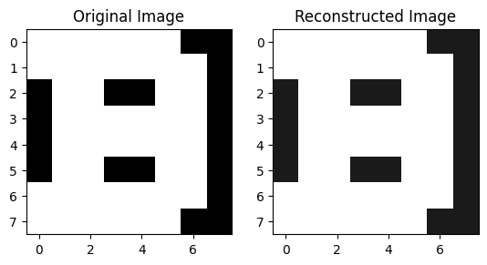
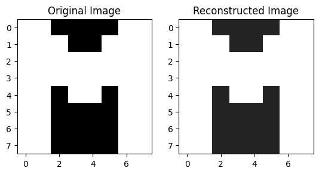

# Quantum Image Encoding (QIE)

Project developed during the Qiskit Hackathon BCN 2023. Memebrs of the team:
- Pau Escofet (Universitat Politècnica de Catalunya)
- Boris Mullendorff (TU Delft)
- Bart Segers (TU Delft)
- Diogo Ramos (Universidade do Oporto)
- Guilherme Botelho (Universidade do Oporto)
- Gerard Marcet (Universitat Autònoma de Brcelona)

In this document we will present and discuss the different methods we have implemented. Each section will refer to a particular Python Notebook.

We have also condensed all the versions of the algorithm in a library-like file [QIE.py](QIE.py), so it can be easily imported and useed into other files, like we have done in the [Getting Started Notebook](QIE_Getting_Started.ipynb)

We firstly defined an evaluation metric called **Reconstruction Sqared Error**. That computes the sum of the squared difference in brightness pixel by pixel of the image. This gives us a nice, objective metric to evaluate the performance of our algorithms.

## Version 1
[Python Notebook](QIE-Version_1-6_Qubits.ipynb)

We encode all $N^2 = 2^{2n}$ brightness values in the $N^2$ coefficients of a $2n$ qubit statevector. Meaning the pixel intensity is encoded in the probability ampliude of the qubits.

This can be done throught the following steps:

1. The following normalization factor is defined:

$$F = \sqrt{\sum_{i=0}^{N^2-1}I_{i}}$$

2. The amplitude vector is defined by taking the square root of the intensities vector:

$$A = \begin{pmatrix} \sqrt{I_{0}}\\ \sqrt{I_{1}}\\ \vdots\\ \sqrt{I_{N^2-1}} \end{pmatrix}$$

3. The state vector is then written as:
$$\ket \psi = A/F$$

Here pixel intensity is therefore proportional to the probability of measuring the corresponding state. The highest pixel intensity is also classically stored and will be used in the decoding process.
$$I_{max} = \max\{I_i\}$$

To then reconstruct the image, we store the counts associated with each state as a vector and get the highest count state, which corresponds to the brightest pixel. We then reconstruct the brightness of the pixels through the following expression, using the previously stored max intensity:

$$R_i = \frac{C_i}{C_{max}}I_{max}$$

To implement this protocol, the states are initialized and transpiled using the backend native gates through the corresponding qiskit functions.

## Version 1.1
[Python Notebook](QIE-Version_1.1-7_Qubits.ipynb)

This version is similar to version 1. Intensities are encoded into the amplitudes of the quantum states. One qubit is added however, which is used to encode the maximum intensity. This is needed since version 1 only contains information on relative intensities in the image.

## Version 2
[Python Notebook](QIE-Version_2-7_Qubits.ipynb)

First we started by implementing the same method that is described in the qiskit textbook. Since it is also describes there, we will be very short here.
Here we need 6 qubits to represent all the positions in the 8x8 picture, and we use a 7th qubit to represent the intensity of each pixel, by performing a controlled Y (or X) rotation. To have a different angle for each pixel, we iterate over all possible combinantions of 6 controls (where each control can be active high or active low). This results in $2^6=64$ controlled rotations. To retrieve the image, you perform tomography and count for each state (pixel) all the instances of measuring 1 on the 7th qubit, and divide by the total number counts for that state (pixel), to assign an intensity for each pixel.

## Version 3
[Python Notebook](QIE-Version_3-Image_Tokenization.ipynb)

On physical hardware, a circuit depth of 250+ induces too much decoherence noise to be able to retrieve the image. To be able to retrieve an 8x8 image on real hardware, we must think of some creative way to reduce this depth drastically. The method we thaught of is a compression method that reduces the depth by a factor of 4, by introducing a little bit of classical information to assist the quantum information. Let me walk you through the method:

We start with a given 8x8 image. Then we create 16 (4x4) buckets, and fill them with the pixels from the 8x8 picture that have the are closest to each other in terms of intensity, in an optimal way (the buckets don't need to be all of the same size). Then, we create a 4x4 picture, where each pixel is assigned the average intensity of one the boxes. We can encode this 4x4 picture in a quantum state with our usual algorithm, but now we have reduced the circuit depth by a factor of 4, since a 4x4 picture is much easier to encode. The final step is to retrieve the picture from the quantum state, again with our standard algorithm, but now the picture will look very different from the original 8x8 picture. So, we have to do one more step, we need have a map which takes the pixels from each bucket to their original position. After this, we have retrieved the original image again. The mapping key would need to by stored or send classically.

The averaging step introduces an error, of course, however this is a very small error for 8x8 already, and will be smaller and smaller when we would scale up the number of pixels. Most importantly, we control this induced error ourselves, and we are less vulnerable to the depolarizing errors, which we don't have any control over. The downside is that you introduce some classical information in your algorithm, however small and easy.

## Version 3.1
[Python Notebook](QIE-Version_3.1-Image_Tokenization_16x16.ipynb)

For this version we wanted to asses the potential of the previous approach, as we think this is the main contribution of this work. For this we have tested the same algorithm, by  compressing an 16x16 greyscale image into a 8x8, and then encoding it as described avobe.

## Version 4
[Python Notebook](QIE-Version_4-Image_Tokenization_V2.ipynb)

When converting our image to an ordered 4x4 image, the initialization of the state becomes drastically more feasible on hardware, owing to the decrease in circuit depth. A critique of this technique, however, could be that we cannot target and perform operations on single pixels while in the quantum state. We can only change 4 joint pixels collectively.
This problem is fixed in the following notebook. Pixels are still grouped together according to their brightness in groups of four and have their intensity averaged over the pixels in their group. They will remain separate pixels however, instead of becoming one, meaning that the pixels can be targeted separately in the quantum state, when using the location_map.
Grouping similar pixels together makes life easier for the qiskit transpiler. It has a much easier time finding a suitable circuit to encode the image after the regrouping step. This results in a lower circuit depth and thus in higher hardware compatibility. The circuit depth is similar to the 4x4 case. This is not surprising since the same exact image is encoded, simply using 2 more qubits.
changes to the transpiler:
When using the qiskit transpiler, often a lot of unnecessary gates remain in the initialization step. A whole sequence of gates often follows a controlled gate, that is controlled on a qubit initialized in state $\ket{0}$. The transpiler had trouble recognizing the fact that its control qubit did not have any gates applied to it prior. It assumed that since there had been gates performed on the other qubit, the two-qubit gates were relevant.
This problem was solved by manually checking whether each control gate had any prior gates applied to the control qubit and removing the controlled gate, if not. After removing the irrelevant control gates, the transpiler was again used to simplify the circuit.

## Best Depth Image Generation
[Python Notebook](QIE-Best_Depth_Image_Generator.ipynb)

We can restrict this algorithm to a certain kind of images to greatly reduce circuit depth and therefore greatly increase fidelity.
In particular, we can restrict ourselves to the case where the image can be encoding using the idea above and the statevector is equal to a product state!
### Encoding
To encode We want to encode an image that is described by a product state and as such we want to control the probability amplitudes for each qubit in the $\ket 0$ and $\ket 1$ basis independently. We do this by applying an $R_X$ gate to each qubit.

### Change to the Native Gates
We can then change this into a sequence of native gates $S_X$ and $R_Z$ for our quantum computer..
If the starting state is $\ket{00\cdots0}$ we have that:

$$
\begin{align*}
S_X R_Z(\varphi)S_X\ket{00\cdots0} = R_X(\varphi - \pi)\ket{00\cdots0}
\end{align*}
$$

A full proof can be found [here](https://www.notion.so/guilhermebaos/Circuit-Visualization-980b8b87e0ae4d7098b9c2fdc577c46b?pvs=4#cc735b8648a54c78bb5c7f5b130669bc).
### Finding out the Original Image
We can calculate the image we are encoding by calculating what image should ideally be recovered as explained above:

$$
\begin{align*}
I_i = \frac{P(i)}{P(max)}I_{max}
\end{align*}
$$

Therefore for any parameters $\varphi_i$ we can compute what the image should be by following these steps, and compare that theoretical image with the quantum computer’s output:
1. We can write out each qubit’s state as follows:

$$
\begin{align*}
R_X\ket{q_i} &= \cos\frac{\theta_i}2\ket 0 -i\sin\frac{\theta_i}2\ket1 =
\\\\
&= \alpha_{i0}\ket 0 + \alpha_{i1}\ket1
\end{align*}
$$

- Where:
  - $q_i$ is the $i$-th qubit, which starts in the state $\ket 0$
  - $\theta_i = \varphi_i - \pi$ is the $i$-th angle of rotation
  - $\alpha_{i0}$ is the probability amplitude that the $i$-th qubit is in state $\ket 0$
  - $\alpha_{i1}$ is the probability amplitude that the $i$-th qubit is in state $\ket 1$
2. We write out the full system state as:
$$
\begin{align*}
\ket \psi &= \sum_{i=0}^{2^k-1}\prod_{j=0}^{k-1}\alpha_{ji_j}\ket i
\end{align*}
$$
- Where:
  - $k = 2n$ is the number of qubits we are using
  - $i_j$ is the $j$-th bit of the binary representation of $i$
3. Use the fact the the probability of measuring $\ket i$ is the squared probability amplitude to write out $I_i$ using the relationship above:
$$
\begin{align*}
P(i) &= \left|\prod_{j=0}^{k-1}\alpha_{ji_j}\ket i\right|^2
\\\\
I_i &= \left|\prod_{j=0}^{k-1}\alpha_{ji_j}\ket i\right|^2 \times \frac{I_{max}}{P(max)}
\end{align*}
$$
### Decoding
For decoding we use the same method as version 1.

# Executions on real hardware

For the executions in real Hardware we have used version 3 of the algorithm, as it has a very low depth (~63) and also a low reconstruction error (~0.02).

Here is the reconstruction:

While running the program on real hardware, the quality of the decompressed image descreases greatly compared to the simulations, as expected (reconstruction error = 2.13).

In order to to minimize the squared error, a resilience_level = 1 and optimization_level = 3 was used yielding better results.

Patterns within the image become recognizable again, proving the compatibility of our encoding method with hardware.
We also noticed that some columns give significantly less accurate results, which may be caused by:

- Qubits having different readout errors and coherence times
- States with more "1"s are more prone to losing information due to decoherence

Columns with less accurate results indeed corresponded to the qubits with the lesser coherence times, confirming our intuition.

On the other hand, when encoding and decoding an image generate using the Best-Depth method, the algorithm perform much better, obtaining a reconstruction error of 0.4!

Last but not least, we ran three experiments in real hardware with pixels only black and white, obtaining an almost perfect reconstruction as we can see below:

##  Thanks for reading this far! We hope you enjoyed our work!