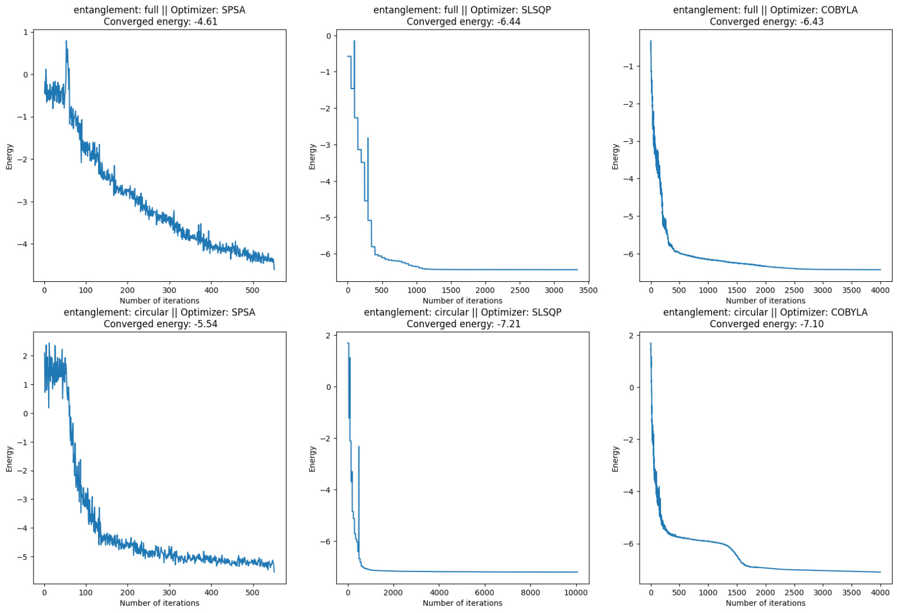
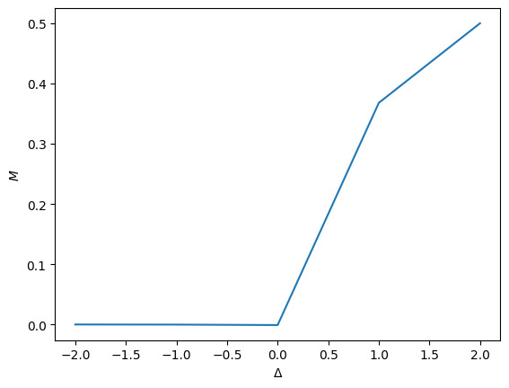
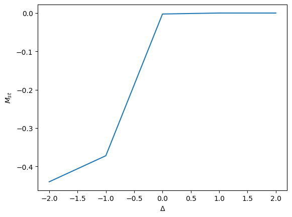
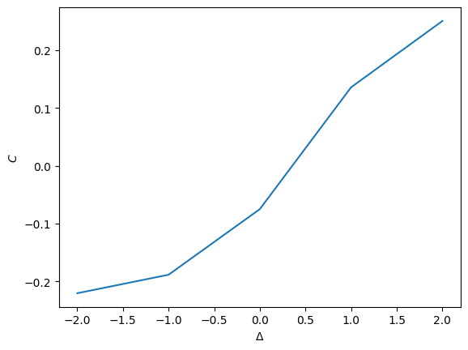
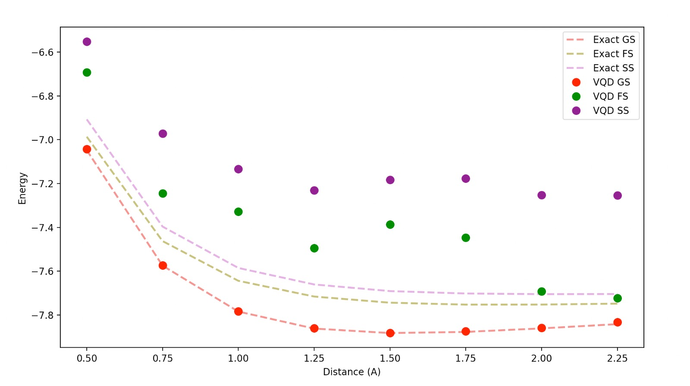

# 33 Documentation

## 1.1 Calculate expected values of the Heisenberg Hamiltonian

The XXZ Heisenberg Hamiltonian is,

$$ H_{XXZ} = -\frac{1}{4}\sum_{i=1}^N \sigma_i^x\sigma_{i+1}^x + \sigma_i^y\sigma_{i+1}^y + \Delta \, \sigma_i^z\sigma_{i+1}^z ,$$

where $\Delta$ is an anisotropy parameter that finally determines in which phase we are. To calculate the hamiltonian expected  value, we can use its linearity property to compute each term expected value, so we can define a circuit for each hamiltonian term separately. For instance, for $N=12$ we will have 36 circuits to calculate all the terms expected values, and by summing we finally get the hamiltonian expected value,

$$\langle H_{XXZ}\rangle = -\frac{1}{4}\sum_{i=1}^N \langle\sigma_i^x\sigma_{i+1}^x\rangle + \langle\sigma_i^y\sigma_{i+1}^y\rangle + \Delta \, \langle\sigma_i^z\sigma_{i+1}^z\rangle .$$

To calculate the energy of the *Ground State* (from now on *GS*) for $\Delta = 4$, we need the *GS* itself, but knowing that $\Delta = 4$ describes a ferromagnetic fase, we know that the *GS* must be a state with all the spins in the same direction. So we can create a circuit with all the qubits in the $|0 \rangle$ state. Then we can map each term of the hamiltonian to a circuit and let the circuit evolve. Finally with the number of counts in the $|0\rangle^{\otimes N}$ we can calculate the expected value. To do that, we know that $H_k|\psi\rangle = \sum c_i |\xi_i\rangle$ where $|\xi_i\rangle$ are the base vectors (that are orthonormal), $H_k$ is each of the unitary terms, so that $H=\sum_k H_k$. If we apply a $\langle \psi |$ state, we get $\langle \psi |H_k|\psi\rangle = \langle \psi |\sum c_i |\xi_i\rangle$. But to get that, we mesure the probabilities, i.e. $|c|^2_i$. Then, the expected value will be $c_i=\sqrt{\frac{counts}{total\ counts}}$. 

We can express the total expected value,

$$H=-\frac{1}{4}\sum_{i=1}^Nc_i^x+c_i^y+\Delta c_i^z ,$$

Before preparing the GS with the VQE algorithm we determine a baseline to compare the variational results. It has been performed by using the ``NumPyMinimumEigensolver`` where we had to introduce our operator matrix, indeed it is the hamiltonian represented in the computational basis. As we know the analytic value for the ferromagnetic cases we have applied it to $\Delta = 4$ in order to test it is actually working. Now, it is clear it works properly we apply this code to the $\Delta = -2$ case, obtaining an Energy for the GS of $\epsilon_{GS}=-7.46$.

Once the baseline is established, we are prepared to begin evaluating ground states generated by applying an ansatz to the Variational Quantum Eigensolver (VQE). The subsequent step involves passing a circuit with only neighboring interactions and three layers, using the Simultaneous Perturbation Stochastic Approximation (SPSA) optimizer.

## 1.2 - Ansatz expressibility

We must then examine its performance for various types of interactions. The proposed interaction is a comprehensive one, encompassing every pair. Additionally, we must configure different optimizers for comparison. Three optimizers are evaluated: 

1. Simultaneous Perturbation Stochastic Approximation (SPSA)
2. Constrained Optimization By Linear Approximations (COBYLA)
3. Sequential Least Squares Programming (SLSQP)

Using these distinct optimizers, we test two ansatzs: 

1. One with only neighboring interactions and three layers
2. Another with full interactions and three layers

 After compaaring these 6 combination, we have come to the conclusion that the COBYLA optimizer with just neighbouring interactions is the one that performs best in our delta range explored from -2 to 2.
 

## 1.3 - Phase Diagram

With the aim to represent the whole quantum transition, a broader set of system features is consiered and studied with the best-performing ansatz and optimizer.

It is worth to note that we have tried to enhance the ansatz, by implementing a new one inspired with the [Bethe ansatz](https://arxiv.org/abs/1609.02100). We eventually decided to implement an ansatz found in a [paper](https://www.researchgate.net/publication/341717102_Scaling_of_variational_quantum_circuit_depth_for_condensed_matter_systems) stuying a similar hamiltonian, and it performs quite well. However, we were used to work with the previous one and the results were quite similar, so we kept using our ansatz.\
Here we present our results comparing the two different ansatz:
  
On the other hand,
 we have evaluated the **magnetization** of the system along the $z$-axis:

$$
M \equiv \frac{1}{2N} \sum_{i=1}^{N} \left\langle \sigma_{i}^{z} \right\rangle\,,
$$

the **staggered magnetization**:

$$
M_{st} \equiv \frac{1}{2N}\sum_{i=1}^N (-1)^i\left\langle\sigma_i^z\right\rangle\,,
$$

and the expectation value of the **nearest-neighbor correlator**:

$$
C \equiv \frac{1}{4N} \sum_{i=1}^{N}\left\langle \sigma_{i}^{z} \sigma_{i+1}^{z}  \right\rangle\,.
$$

Subsequently, we plot these observables as a function of $\Delta$:

To calculate the **magnetization** and the **nearest-neighbor correlator**, we utilize the Heisenberg Model function from the Qiskit library by modifying its arguments. For the **magnetization**, we simply apply a magnetic field along the z-axis, with all the Hamiltonian constants set to 0, and then divide by 'N'. For the **nearest-neighbor correlator**, we set 1 for the parameter corresponding to the neighboring term in the z-axis.

To calculate the **magnetization** and the **nearest-neighbor correlator**, we utilize the Heisenberg Model function from the Qiskit library by modifying its arguments. For the **magnetization**, we simply apply a magnetic field along the z-axis, with all the Hamiltonian constants set to 0, and then divide by 'N'. For the **nearest-neighbor correlator**, we set 1 for the parameter corresponding to the neighboring term in the z-axis.

Finally, calculating the **staggered magnetization** has been challenging due to the alternating -1 factor. We addressed this by obtaining the entire Heisenberg Model class directly from the Qiskit repository and modifying it appropriately to achieve the desired result, which is introducing this to the specific coefficient we are using.

# 2. FERMIONS IN EXCITED STATES: THE LITHIUM HYDRATE MOLECULE 
In this step, we will use the same procediment to calculate the bounding energies for the ``LiH`` with the interdistance. First of all we will calculate the energy for the distance $d~2\AA$ and then we will try to determine the interdistance in wich the energy is minimum.

## 2.1 - Molecular spectra
The approach to this problem will be to solve first the 2.2 and then particularize to the 2.1. But in general, the problem with this task was the deprecated code and the tutorials where we should get the how-to go from the deprecated to the actualized, were old. 

## 2.2 - Spectrum as function of the bond length
For the general problem we used the ``HartreeFock`` ``ansatz`` and began with a $|0\rangle^{\otimes N}$ state. Then we used a VQE with the ``COBYLA`` optimizer to calculate the *GS* and a VQD to calculate the excited states (2 excited)

## 2.3 - Imperfect devices
If we want to simulate a more real system, we implemented a general noise. We refer to the code in order to see how it's been done and the energies obtained.

## 3. Mastering quantum simulation shenanigans
From here, we implemented what we had time: We uploaded the VQE into the quantum machine. From here, we should have gotten the topology of the qubit with a fake backend and try to implement what we had without the simulators (or the numerical solvers).

### Problems
------------------

1. We didn't know how to plan the first exercise, because of the `HeisenbergModel` methods. We hopped that with that class we could implement it, but we had to really understand what do we had to calculate, so we could split the expected values using the linearity and calculate the expected values for each terms.
2. Because of the first problem, the second problem was harder to develop, because we thought we had to hard-code the hamiltonian, but with this approach we had to compute matrix operations with matrix $2^{12}\times 2^{12}$. Then we realised how to use the `HeisenbergModel` class, so the calculations sped up.
3. When we got to the `VQE`, we didn't import correctly this algorithm, because if you import it from `qiskit.algorithms`, you get the deprecated version. After some research we realised that we had to import it from the `qiskit.algorithms.minimum_eigensolvers`. We created an issue in GitHub that now is closed, as this import has a reason to exist: some ancient code will be broken if this import wasn't like this.
4. Going to the phase diagram, the computation of the expected values was not trivial: we had to compute first a *GS* with the ``VQE`` and then use the `aux_operators`.
5. In the second problem, ``num_particles`` was giving trouble, due to matrix shapes being not compatible. We solved this by adding an argument, forcing the matri to have the shape that we want
6. Qiskit tutorials were not updated, so we had a hard time discovering what to use and how to use it
7. The tutorial to go from the deprecated to the non-deprecated version, was not up to date